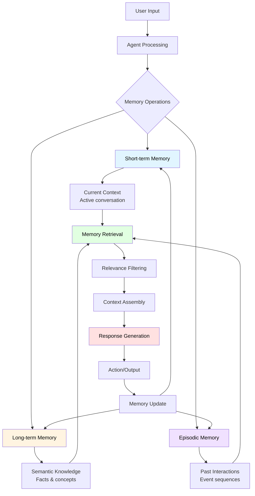

# Memory

The full example for this section can be found [in the GitHub repo.](https://github.com/0xPlaygrounds/rig-book/blob/main/snippets/memory/src/main.rs)

## What is Memory?

Agentic memory (or just "memory") in AI applications refers to the system's ability to retain and utilize information from previous interactions. Without memory, each conversation with an LLM starts from scratch—the model has no awareness of what was discussed moments ago. Memory allows your AI application to maintain context across multiple exchanges, creating more coherent and personalized experiences.

## The Use Case for Memory

Consider a customer support chatbot. Without memory, a user asking "What's the status of my order?" followed by "Can you cancel it?" would leave the AI confused—it wouldn't know which order to cancel. With memory, the conversation flows naturally, just as it would with a human agent.

Memory becomes critical in several scenarios:
- **Multi-turn conversations** where context builds over time
- **Personalized interactions** that adapt based on user preferences
- **Task-oriented dialogues** where the AI needs to track goals and progress
- **Long-running sessions** where conversations span multiple topics

The following diagram can be used to describe an agentic loop that uses memory. It attempts to retrieve relevant memories (with retrieval/filtering often in the same step), assembles context for our agent based on the memories and then finally once the full request is assembled the agent will then send the prompt to the LLM. Once a response has been retrieved, it might then check if memories need updating (and update accordingly).


## Basic Memory Management in Rig

In Rig, conversation history is currently decoupled from the library - which is to say that you need to implement it yourself. The simplest form of memory management is storing a conversation history as a `Vec<T>`. Each exchange between the user and the assistant is stored as a `Message` object:

```rust
use rig::message::Message;

let mut conversation_history: Vec<Message> = Vec::new();
```

As the conversation progresses, you append new messages to this vector:

```rust
// Add a user message
conversation_history.push(Message::User {
    content: OneOrMany::one(
        UserContent::text("Do you know what the weather is like today?")
    )
});

// Add the assistant's response
conversation_history.push(Message::Assistant {
    content: OneOrMany::one(
        AssistantContent::text("I don't have access to real-time weather data...")
    )
});
```

When making subsequent requests to the LLM, you include this history to maintain context. However, this approach has a fundamental limitation: conversation history grows indefinitely, eventually exceeding the model's context window and increasing costs.

## Managing Ephemeral Conversation Memory

To handle growing conversation histories, you'll need a more sophisticated approach. Let's create a `ConversationMemory` struct that can both manage messages and compact them when needed.

First, define the basic structure:

```rust
use rig::completion::Message;

pub struct ConversationMemory {
    messages: Vec<Message>,
    max_messages: usize,
    summary: Option<String>,
}

impl ConversationMemory {
    pub fn new(max_messages: usize) -> Self {
        Self {
            messages: Vec::new(),
            max_messages,
            summary: None,
        }
    }
}
```

Add methods for basic message management:

```rust
impl ConversationMemory {
    pub fn add_user_message(&mut self, input: &str) {
        let message = Message::User {
            content: OneOrMany::one(UserContent::text(input))
        };
        
        self.messages.push(message);
    }
    
    pub fn add_assistant_message(&mut self, input: &str) {
        let message = Message::Assistant {
            content: OneOrMany::one(AssistantContent::text(input))
        };
        
        self.messages.push(message);
    }

    pub fn get_messages(&self) -> &[Message] {
        &self.messages
    }

    pub fn clear(&mut self) {
        self.messages.clear();
    }
}
```
Although being able to clear and fetch/add messages is quite useful, will also need a way to compact the messages by generating a summary. 

Typically there are a number of ways this can be done, but for the sake of simplicity we will hold a variable that has a number of maximum messages. If the message length passes the threshold, we clear the message list and ask the LLM to generate a summary.

```rust
use rig::completion::CompletionModel;
use rig::completion::Prompt;

impl ConversationMemory {
    pub async fn compact<T>(&mut self, client: &T) -> Result<(), Box<dyn std::error::Error>> 
        where
        T: CompletionModel
    {
        if self.messages.len() <= self.max_messages {
            return Ok(());
        }

        // Create a prompt asking the LLM to summarize the conversation
        let summary_prompt = format!(
            "Please provide a concise summary of the following conversation, \
             capturing key points, decisions, and context:\n\n{}",
            self.format_messages_for_summary()
        );

        // Request the summary from the LLM
        let response = client
            .prompt(&summary_prompt)
            .send()
            .await?;

        self.summary = Some(response);
        self.messages.clear();

        Ok(())
    }

    fn format_messages_for_summary(&self) -> String {
        self.messages
            .iter()
            .map(|msg| format!("{}: {}", msg.role, msg.content))
            .collect::<Vec<_>>()
            .join("\n")
    }
}
```

You can inject the summary back into the conversation in two ways. The first approach adds it to the system prompt:

```rust
impl ConversationMemory {
    pub fn build_system_prompt(&self, base_prompt: &str) -> String {
        match &self.summary {
            Some(summary) => {
                format!(
                    "{}\n\nPrevious conversation summary:\n{}",
                    base_prompt, summary
                )
            }
            None => base_prompt.to_string(),
        }
    }
}
```

Alternatively, you can add the summary as a user message at the start of the conversation:

```rust
impl ConversationMemory {
    pub fn get_message_summary(&self) -> Vec<Message> {
        let mut messages = Vec::new();

        if let Some(summary) = &self.summary {
            messages.push(
                Message::User {
                    content: OneOrMany::one(
                        UserContent::text(format!("Context from previous conversation:\n{}", summary).as_ref())))
                }
            )};
            
        messages
    }
}
```

In practice, this is how you'd use it:

```rust
let mut memory = ConversationMemory::new(10);

// Add messages as the conversation progresses
memory.add_message("user", "Tell me about Rust");
memory.add_message("assistant", "Rust is a systems programming language...");

// When the conversation grows too long, compact it
if memory.get_messages().len() > memory.max_messages {
    memory.compact(&client).await?;
}

// Build your next request with the summary included
let messages = memory.get_messages_with_summary();
```

Although you can see here that the compaction is manual, there's a lot of ways you can build around it: you can check to see if the window needs compacting after every message, you could compact it based on token limit (although this would need a tokenizer to count tokens).

## Strategies for Long-Term Memory

While conversation compaction handles ephemeral memory, many applications need to retain information across sessions. Here are three strategies for managing long-term memory:

### 1. Conversation Observations

Conversation observations capture insights about specific exchanges. These might include:
- Important decisions made during the conversation
- Questions that remain unanswered
- Topics the user expressed strong interest in

Implementation approach:
```rust
pub struct ConversationObservation {
    pub timestamp: DateTime<Utc>,
    pub topic: String,
    pub insight: String,
    pub importance: f32,
}
```

After each significant exchange, use an LLM to extract observations:

```rust
let extraction_prompt = format!(
    "Extract key observations from this conversation exchange. \
     Focus on decisions, preferences, and important context:\n\n{}",
    recent_messages
);
```

Store these observations in a database or vector store, retrieving the most relevant ones when starting new conversations.

### 2. User Observations

User observations track persistent information about the user themselves:
- Stated preferences ("I'm vegetarian")
- Personal context ("I live in Seattle")
- Communication style ("I prefer concise answers")
- Long-term goals or projects

These observations should be:
- **Maintained separately** from conversation history
- **Updated incrementally** as new information emerges
- **Verified before use** to ensure they're still accurate

Consider using a structured format:

```rust
pub struct UserProfile {
    pub preferences: HashMap<String, String>,
    pub context: Vec<String>,
    pub communication_style: Option<String>,
    pub last_updated: DateTime<Utc>,
}
```

Periodically ask the LLM to extract user observations from recent conversations:

```rust
let profile_prompt = 
    "Based on the recent conversations, extract any new information about \
     the user's preferences, context, or communication style. Return only \
     new or updated information.";
```

### 3. Grounded Facts

Grounded facts are verifiable pieces of information that emerged during conversations:
- External information retrieved during the session
- Calculations or analyses performed
- File contents or data processed
- API responses or database queries

These differ from observations because they're objectively verifiable and often come from external sources rather than the conversation itself.

Store grounded facts with their source and timestamp:

```rust
pub struct GroundedFact {
    pub fact: String,
    pub source: String,
    pub timestamp: DateTime<Utc>,
    pub confidence: f32,
    pub conversation_id: String,
}
```

When starting a new conversation, retrieve relevant facts:

```rust
// Retrieve facts related to the current conversation context
let relevant_facts = fetch_facts_by_relevance(
    current_topic,
    max_facts: 5,
)?;

// Include them in the system prompt or as initial messages
let context = format!(
    "Relevant information from previous interactions:\n{}",
    relevant_facts.join("\n")
);
```

### Caching

Generally speaking, effective memory systems don't just have a single data source that it pulls from. The most production-capable systems often have multiple tiers of memory storage to accommodate for different needs. Typically, one of these should allow for fast fetching of the most commonly fetched items - using a caching layer. Whether it's in memory, through Redis or Memcache (or perhaps another service dedicating to  caching), caching is highly versatile and agentic memory is no exception.

How to create caches and use them is already a very well-trodden topic, and as such a full implementation will not be provided here. However, there are some highly useful crates you can use to help create your own memory cache:
- [lru](https://github.com/jeromefroe/lru-rs) - an implementation of a Least Recently Used cache
- [slotmap](https://crates.io/crates/slotmap) - A data structure with low overhead for storing, inserting and deleting items

## Combining Memory Strategies

The most effective AI applications combine multiple memory strategies:

1. **Ephemeral memory** maintains immediate context through the conversation history and compaction
2. **Observations** capture insights about the conversation and user over time
3. **Grounded facts** preserve verified information that might be needed again

When building a new conversation context, you might:
- Load the user's profile to personalize responses
- Retrieve relevant observations from past conversations
- Fetch grounded facts related to the current topic
- Maintain the current conversation in ephemeral memory
- Compact the conversation when it grows too large

This layered approach ensures your AI application has access to the right information at the right time, without overwhelming the model's context window or your budget.
