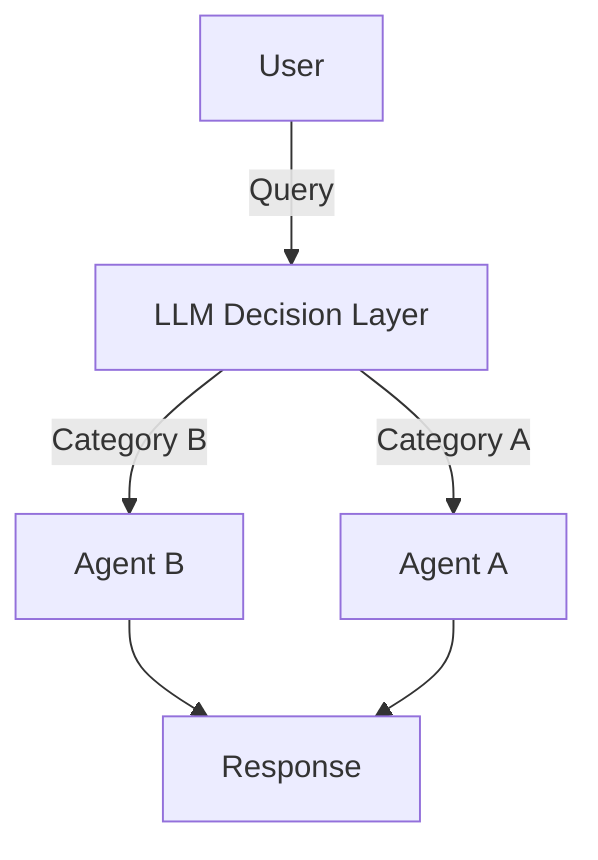

# Model Routing

Model routing allows you to dynamically select different agents based on the incoming request. This enables you to build sophisticated systems where requests are intelligently routed to specialized agents. For example, if you run a sales team you might have a domain expert agent, an agent to assist with sales engineering and an agent to help you check in on your team's performance and where they may need unblocking - all under one chat interface. By using model routing, we can effectively model a system that accurately categorises which agent the query should go to.

## Use cases for model routing
Model routing is a simple concept that simultaneously solves a lot of issues in AI systems by using it as the following:
- A guardrail layer (to make sure the model only responds to certain topics)
- Route to other models depending on topic, creating a multi-layered system
- You can also use it to route to a less or more expensive model (eg if you need a fallback model)

In terms of execution, there are two basic types of routers that are then expanded on. You can use a basic LLM decision layer that non-deterministically does the routing for you with no initial infrastructure setup required, or you can alternatively use something else like semantic routing with embeddings which is much more effective but also requires more setup.

## Simple LLM routing
Below is a diagram which depicts the data flow for an LLM-based router:


LLM-based routers are quite easy to set up and can be used to validate an MVP very easily, but often come with drawbacks that would not be present in a semantic router.

First, let's set up a barebones routing system that basically asks the LLM to return a single word based on what we ask it. This code snippet will do the following:
- Initialise two different agents representing possible "routes" on an LLM router
- Initialise a third agent that basically acts as a decision layer
- Prompt the third agent, then prompt one of the two routes depending on what was returned (returning an error if no suitable topic found)

```rust
use rig::{completion::Prompt, providers::openai};

#[tokio::main]
async fn main() -> Result<(), Box<dyn std::error::Error>> {
    // Initialize the OpenAI client
    let openai_client = openai::Client::from_env();

    // Create specialized agents
    let coding_agent = openai_client
        .agent("gpt-5")
        .preamble("You are an expert coding assistant specializing in Rust programming.")
        .build();

    let math_agent = openai_client
        .agent("gpt-5")
        .preamble("You are a mathematics expert who excels at solving complex problems.")
        .build();

    let router = openai_client
        .agent("gpt-5-mini") // we can afford to use a less expensive model here as the computation required is significantly less
        .preamble("Please return a word from the allowed options list,
            depending on which word the user's question is more closely related to. Skip all prose.
            
            Options: [\'rust', 'maths']
            ")
        .build();
    
    let prompt = "How do I use async with Rust?";

    let topic = router.prompt(prompt).await?;
    
    println!("Topic selected: {topic}");
    
    let res = if topic.contains("math") {
        math_agent.prompt(prompt).await?
    } else if topic.contains("rust") {
        coding_agent.prompt(prompt).await?
    } else {
        return Err(format!("No route found in text: {topic}").into());
    };
    
    println!("Response: {res}");

    Ok(())
}
```

While this does work, in a production use case you may want to make the implementation more resilient by doing the following, which we'll cover below:
- Using embeddings for more control over the router topic selection (no potentially wildly wrong text!)
- Using the Rust type system to properly type our agents, as well as covering dynamic dispatch for agent routing

## Router Type-safety
Okay, so instead of just having all our agents in one function let's imagine instead that we have a router that can take any kind of agent.

```rust
use rig::completion::CompletionModel;

struct TypedRouter<R> 
    where
    R: CompletionModel
{
    route: HashMap<String, R>
}

impl<R1> TypedRouter<(R1,)>
where R1: CompletionModel
{
    pub fn add_route<R2>(mut self, route: R2) -> TypedRouter<(R1, R2)>
        where R2: CompletionModel {
            self.completion
        }
}
```

## Advanced Router with Embeddings

For more sophisticated routing, use embeddings to semantically match queries to agents:

```rust
use rig::{
    completion::Prompt,
    embeddings::EmbeddingsBuilder,
    providers::openai,
    vector_store::in_memory_store::InMemoryVectorStore,
};

struct RouteDefinition {
    name: String,
    description: String,
    examples: Vec<String>,
}

async fn create_semantic_router(
    openai_client: &openai::Client,
) -> Result<InMemoryVectorStore<RouteDefinition>, Box<dyn std::error::Error>> {
    let routes = vec![
        RouteDefinition {
            name: "coding".to_string(),
            description: "Programming, code, and software development".to_string(),
            examples: vec![
                "How do I write a function?".to_string(),
                "Debug this code".to_string(),
                "Implement a sorting algorithm".to_string(),
            ],
        },
        RouteDefinition {
            name: "math".to_string(),
            description: "Mathematics, calculations, and equations".to_string(),
            examples: vec![
                "Solve this equation".to_string(),
                "Calculate the derivative".to_string(),
                "What is 15% of 200?".to_string(),
            ],
        },
    ];

    let mut vector_store = InMemoryVectorStore::default();
    
    for route in routes {
        let embedding_text = format!(
            "{}: {}. Examples: {}",
            route.name,
            route.description,
            route.examples.join(", ")
        );
        
        let embedding = openai_client
            .embeddings("text-embedding-ada-002")
            .simple_document(&embedding_text)
            .await?;
            
        vector_store.add_document(route, embedding);
    }

    Ok(vector_store)
}

async fn semantic_route_query(
    query: &str,
    router: &InMemoryVectorStore<RouteDefinition>,
    openai_client: &openai::Client,
) -> Result<String, Box<dyn std::error::Error>> {
    // Get query embedding
    let query_embedding = openai_client
        .embeddings("text-embedding-ada-002")
        .simple_document(query)
        .await?;

    // Find most similar route
    let results = router.top_n(&query_embedding, 1);
    
    let route_name = results
        .first()
        .map(|(route, _score)| route.name.as_str())
        .unwrap_or("general");

    Ok(route_name.to_string())
}
```

## Axum-Style Router Pattern with Multiple Agent Types

Create a router structure that supports different agent types (OpenAI, Anthropic, etc.):

```rust
use std::collections::HashMap;
use rig::{completion::Prompt, providers::{openai, anthropic}};

// Type-erased agent that can handle any provider
pub struct AgentRouter {
    routes: HashMap<String, Box<dyn AgentHandler>>,
}

// Trait to allow different agent types to be stored together
trait AgentHandler: Send + Sync {
    fn prompt(&self, query: &str) -> impl std::future::Future<Output = Result<String, Box<dyn std::error::Error>>> + Send;
}

// Implement for any agent type that implements Prompt
impl<T> AgentHandler for T
where
    T: rig::completion::CompletionModel + Send + Sync,
{
    async fn prompt(&self, query: &str) -> Result<String, Box<dyn std::error::Error>> {
        Ok(Prompt::prompt(self, query).await?)
    }
}

impl AgentRouter {
    pub fn new() -> Self {
        Self {
            routes: HashMap::new(),
            default_route: String::from("default"),
        }
    }

    pub fn route<A>(mut self, path: &str, agent: A) -> Self
    where
        A: AgentHandler + 'static,
    {
        self.routes.insert(path.to_string(), Box::new(agent));
        self
    }

    pub fn default_route(mut self, path: &str) -> Self {
        self.default_route = path.to_string();
        self
    }

    pub async fn handle(
        &self,
        route_key: &str,
        query: &str,
    ) -> Result<String, Box<dyn std::error::Error>> {
        let agent = self
            .routes
            .get(route_key)
            .or_else(|| self.routes.get(&self.default_route))
            .ok_or("No agent found for route")?;

        let response = agent.prompt(query).await?;
        Ok(response)
    }
}
```
This then allows you to use a multi-provider router by simply creating and adding more agents:

```rust
async fn setup_multi_provider_router() -> Result<AgentRouter, Box<dyn std::error::Error>> {
    let openai_client = openai::Client::from_env();
    let anthropic_client = rig::providers::anthropic::Client::from_env();
    
    let coding_agent = openai_client
        .agent("gpt-4")
        .preamble("You are an expert Rust programmer.")
        .build();
    let maths_agent = anthropic_client
        .agent("claude-sonnet-4-20250514")
        .preamble("You are a mathematics expert.")
        .build(),

    let router = AgentRouter::new()
        .route("coding", coding_agent)
        .route("math", maths_agent);

    Ok(router)
}
```

## Alternative: Enum-Based Multi-Provider Router

For more explicit control, use an enum to represent different agent types:

```rust
use std::collections::HashMap;
use rig::{providers::{openai, anthropic}, completion::Prompt};

pub enum MultiProviderAgent {
    OpenAI(openai::Agent),
    Anthropic(anthropic::Agent),
}

impl MultiProviderAgent {
    pub async fn prompt(&self, query: &str) -> Result<String, Box<dyn std::error::Error>> {
        match self {
            Self::OpenAI(agent) => Ok(agent.prompt(query).await?),
            Self::Anthropic(agent) => Ok(agent.prompt(query).await?),
        }
    }
}

pub struct TypedAgentRouter {
    routes: HashMap<String, MultiProviderAgent>,
    default_route: String,
}

impl TypedAgentRouter {
    pub fn new() -> Self {
        Self {
            routes: HashMap::new(),
            default_route: String::from("default"),
        }
    }

    pub fn route(mut self, path: &str, agent: MultiProviderAgent) -> Self {
        self.routes.insert(path.to_string(), agent);
        self
    }

    pub fn default_route(mut self, path: &str) -> Self {
        self.default_route = path.to_string();
        self
    }

    pub async fn handle(
        &self,
        route_key: &str,
        query: &str,
    ) -> Result<String, Box<dyn std::error::Error>> {
        let agent = self
            .routes
            .get(route_key)
            .or_else(|| self.routes.get(&self.default_route))
            .ok_or("No agent found for route")?;

        agent.prompt(query).await
    }
}

// Usage
async fn setup_typed_router() -> Result<TypedAgentRouter, Box<dyn std::error::Error>> {
    let openai_client = openai::Client::from_env();
    let anthropic_client = anthropic::Client::from_env();

    let router = TypedAgentRouter::new()
        .route(
            "coding",
            MultiProviderAgent::OpenAI(
                openai_client
                    .agent("gpt-4")
                    .preamble("You are a coding expert.")
                    .build(),
            ),
        )
        .route(
            "creative",
            MultiProviderAgent::Anthropic(
                anthropic_client
                    .agent("claude-sonnet-4-20250514")
                    .preamble("You are a creative writer.")
                    .build(),
            ),
        )
        .default_route("coding");

    Ok(router)
}
```

## Complete Multi-Provider Example

Here's a complete example using multiple providers with semantic routing:

```rust
#[tokio::main]
async fn main() -> Result<(), Box<dyn std::error::Error>> {
    let openai_client = openai::Client::from_env();
    let anthropic_client = anthropic::Client::from_env();

    // Set up router with mixed providers
    let router = AgentRouter::new()
        .route(
            "coding",
            openai_client
                .agent("gpt-4")
                .preamble("You are an expert Rust programmer.")
                .build(),
        )
        .route(
            "creative",
            anthropic_client
                .agent("claude-sonnet-4-20250514")
                .preamble("You are a creative writing expert.")
                .build(),
        )
        .route(
            "math",
            openai_client
                .agent("gpt-4")
                .preamble("You are a mathematics expert.")
                .build(),
        )
        .route(
            "analysis",
            anthropic_client
                .agent("claude-opus-4-20250514")
                .preamble("You are an expert at deep analytical reasoning.")
                .build(),
        )
        .route(
            "default",
            openai_client
                .agent("gpt-4")
                .preamble("You are a helpful general assistant.")
                .build(),
        )
        .default_route("default");

    // Create semantic router for determining routes
    let semantic_router = create_semantic_router(&openai_client).await?;

    // Handle queries routed to different providers
    let queries = vec![
        "How do I implement error handling in Rust?",  // -> OpenAI (coding)
        "Write a short poem about the ocean",           // -> Anthropic (creative)
        "What's the derivative of x²?",                 // -> OpenAI (math)
        "Analyze the themes in Shakespeare's Hamlet",   // -> Anthropic (analysis)
    ];

    for query in queries {
        let route = semantic_route_query(query, &semantic_router, &openai_client).await?;
        let response = router.handle(&route, query).await?;
        
        println!("Query: {}", query);
        println!("Route: {}", route);
        println!("Response: {}\n", response);
    }

    Ok(())
}
```

## Key Concepts

- **Route Definition**: Each route maps to a specialized agent with specific expertise
- **Multi-Provider Support**: Mix OpenAI, Anthropic, and other providers in the same router
- **Type Erasure vs Explicit Types**: Choose between trait objects for flexibility or enums for type safety
- **Semantic Matching**: Use embeddings to intelligently match queries to the most appropriate route
- **Fallback Strategy**: Always provide a default route for queries that don't match any specific pattern
- **Agent Specialization**: Configure each agent's preamble to optimize for its routing domain
- **Provider Selection**: Route to the best provider for each task (e.g., OpenAI for code, Anthropic for analysis)

This pattern allows you to build scalable, intelligent routing systems that direct queries to the most appropriate specialized agent from any provider automatically.
