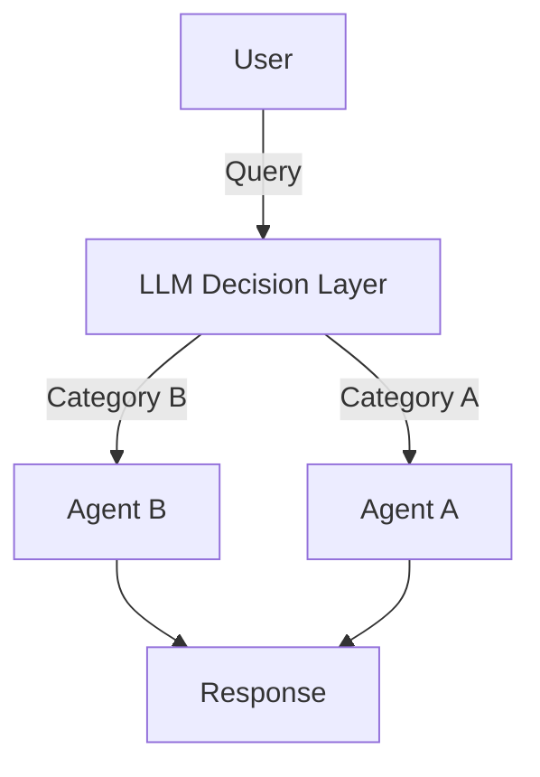

# Model Routing

Model routing allows you to dynamically select different agents based on the incoming request. This enables you to build sophisticated systems where requests are intelligently routed to specialized agents. For example, if you run a sales team you might have a domain expert agent, an agent to assist with sales engineering and an agent to help you check in on your team's performance and where they may need unblocking - all under one chat interface. By using model routing, we can effectively model a system that accurately categorises which agent the query should go to.

## Use cases for model routing
Model routing is a simple concept that simultaneously solves a lot of issues in AI systems by using it as the following:
- A guardrail layer (to make sure the model only responds to certain topics)
- Route to other models depending on topic, creating a multi-layered system
- You can also use it to route to a less or more expensive model (eg if you need a fallback model)

In terms of execution, there are two basic types of routers that are then expanded on. You can use a basic LLM decision layer that non-deterministically does the routing for you with no initial infrastructure setup required, or you can alternatively use something else like semantic routing with embeddings which is much more effective but also requires more setup.

## Simple LLM routing
Below is a diagram which depicts the data flow for an LLM-based router:


LLM-based routers are quite easy to set up and can be used to validate an MVP very easily, but often come with drawbacks that would not be present in a semantic router.

First, let's set up a barebones routing system that basically asks the LLM to return a single word based on what we ask it. This code snippet will do the following:
- Initialise two different agents representing possible "routes" on an LLM router
- Initialise a third agent that basically acts as a decision layer
- Prompt the third agent, then prompt one of the two routes depending on what was returned (returning an error if no suitable topic found)

```rust
use rig::{completion::Prompt, providers::openai};

#[tokio::main]
async fn main() -> Result<(), Box<dyn std::error::Error>> {
    // Initialize the OpenAI client
    let openai_client = openai::Client::from_env();

    // Create specialized agents
    let coding_agent = openai_client
        .agent("gpt-5")
        .preamble("You are an expert coding assistant specializing in Rust programming.")
        .build();

    let math_agent = openai_client
        .agent("gpt-5")
        .preamble("You are a mathematics expert who excels at solving complex problems.")
        .build();

    let router = openai_client
        .agent("gpt-5-mini") // we can afford to use a less expensive model here as the computation required is significantly less
        .preamble("Please return a word from the allowed options list,
            depending on which word the user's question is more closely related to. Skip all prose.
            
            Options: [\'rust', 'maths']
            ")
        .build();
    
    let prompt = "How do I use async with Rust?";

    let topic = router.prompt(prompt).await?;
    
    println!("Topic selected: {topic}");
    
    let res = if topic.contains("math") {
        math_agent.prompt(prompt).await?
    } else if topic.contains("rust") {
        coding_agent.prompt(prompt).await?
    } else {
        return Err(format!("No route found in text: {topic}").into());
    };
    
    println!("Response: {res}");

    Ok(())
}
```

While this does work, in a production use case you may want to make the implementation more resilient by doing the following, which we'll cover below:
- Using embeddings for more control over the router topic selection (no potentially wildly wrong text!)
- Using the Rust type system to properly type our agents, as well as covering dynamic dispatch for agent routing

## Router Type-safety
Instead of just having all our agents in one function let's imagine instead that we have a router that can take any kind of agent (from a given provider).

```rust
type OpenAIAgent = Agent<rig::providers::openai::ResponsesCompletionModel>;

struct TypedRouter {
    routes: HashMap<String, OpenAIAgent>,
}

impl TypedRouter {
    pub fn new() -> Self {
        Self {
            routes: HashMap::new(),
        }
    }

    pub fn add_route(mut self, route_loc: &str, agent: OpenAIAgent) -> Self {
        self.routes.insert(route_loc.to_string(), agent);
        self
    }

    pub fn fetch_agent(&self, route: &str) -> Option<&OpenAIAgent> {
        self.routes.get(route)
    }
}
```

At the cost of only being able to use agents from a single provider, this makes it quite easy to create simple routers for non-complex use cases. For example: tasks that require simple data classification and a canned answer vs. a full LLM response might use gpt-5-mini and GPT-5.2, respectively.

## Advanced Router with Embeddings

For more sophisticated routing, use embeddings to semantically match queries to agents:

```rust
use rig::{
    completion::Prompt,
    embeddings::EmbeddingsBuilder,
    providers::openai,
    vector_store::in_memory_store::InMemoryVectorStore,
};
use serde::{Deserialize, Serialize};

#[derive(Clone, Default, Serialize, Deserialize, Eq, PartialEq)]
struct RouteDefinition {
    name: String,
    description: String,
    examples: Vec<String>,
}

async fn create_semantic_router(
    openai_client: &openai::Client,
) -> Result<InMemoryVectorStore<RouteDefinition>, Box<dyn std::error::Error>> {
    let routes = vec![
        RouteDefinition {
            name: "coding".to_string(),
            description: "Programming, code, and software development".to_string(),
            examples: vec![
                "How do I write a function?".to_string(),
                "Debug this code".to_string(),
                "Implement a sorting algorithm".to_string(),
            ],
        },
        RouteDefinition {
            name: "math".to_string(),
            description: "Mathematics, calculations, and equations".to_string(),
            examples: vec![
                "Solve this equation".to_string(),
                "Calculate the derivative".to_string(),
                "What is 15% of 200?".to_string(),
            ],
        },
    ];

    let mut vector_store = InMemoryVectorStore::default();
    
    for route in routes {
        let embedding_text = format!(
            "{}: {}. Examples: {}",
            route.name,
            route.description,
            route.examples.join(", ")
        );
        
        let embedding = openai_client
            .embeddings("text-embedding-ada-002")
            .simple_document(&embedding_text)
            .await?;
            
        vector_store.add_document(route, embedding);
    }

    Ok(vector_store)
}

async fn semantic_route_query(
    query: &str,
    router: &InMemoryVectorStore<RouteDefinition>,
    openai_client: &openai::Client,
) -> Result<String, Box<dyn std::error::Error>> {
    let embedding_model = openai_client.embedding_model("text-embedding-ada-002");

    let index = router.clone().index(embedding_model);

    let req = VectorSearchRequest::builder()
        .query(query)
        .samples(1)
        .build()?;

    let results = index.top_n::<RouteDefinition>(req).await.unwrap();

    // Currently speaking there's no similarity score threshold
    // so this should always return at least one sample/result
    let route_name = results
        .first()
        .map(|(_, _, route_def)| route_def.name.as_str())
        .unwrap();

    Ok(route_name.to_string())
}
```

## Complete Multi-Provider Example

Here's a complete example using multiple providers with semantic routing:

```rust
#[tokio::main]
async fn main() -> Result<(), Box<dyn std::error::Error>> {
    let openai_client = openai::Client::from_env();
    let coding_agent = openai_client
        .agent("gpt-5")
        .preamble("You are an expert coding assistant specializing in Rust programming.")
        .build();

    let math_agent = openai_client
        .agent("gpt-5")
        .preamble("You are a mathematics expert who excels at solving complex problems.")
        .build();

    let rtr = TypedRouter::new()
        .add_route("rust", coding_agent)
        .add_route("maths", math_agent);

    let semantic_router = create_semantic_router(&openai_client).await?;

    let prompt = "How do I use async with Rust?";
    println!("Prompt: {prompt}");

    let route_name = semantic_route_query(prompt, &semantic_router, &openai_client).await?;
    println!("Route name selected: {route_name}");

    let response = rtr
        .fetch_agent(&route_name)
        .unwrap()
        .prompt(prompt)
        .await
        .unwrap();

    println!("Response: {response}");

    Ok(())
}
```

## Key Concepts

- **Route Definition**: Each route maps to a specialized agent with specific expertise
- **Multi-Provider Support**: Mix OpenAI, Anthropic, and other providers in the same router
- **Type Erasure vs Explicit Types**: Choose between trait objects for flexibility or enums for type safety
- **Semantic Matching**: Use embeddings to intelligently match queries to the most appropriate route
- **Fallback Strategy**: Always provide a default route for queries that don't match any specific pattern
- **Agent Specialization**: Configure each agent's preamble to optimize for its routing domain
- **Provider Selection**: Route to the best provider for each task (e.g., OpenAI for code, Anthropic for analysis)

This pattern allows you to build scalable, intelligent routing systems that direct queries to the most appropriate specialized agent from any provider automatically.
