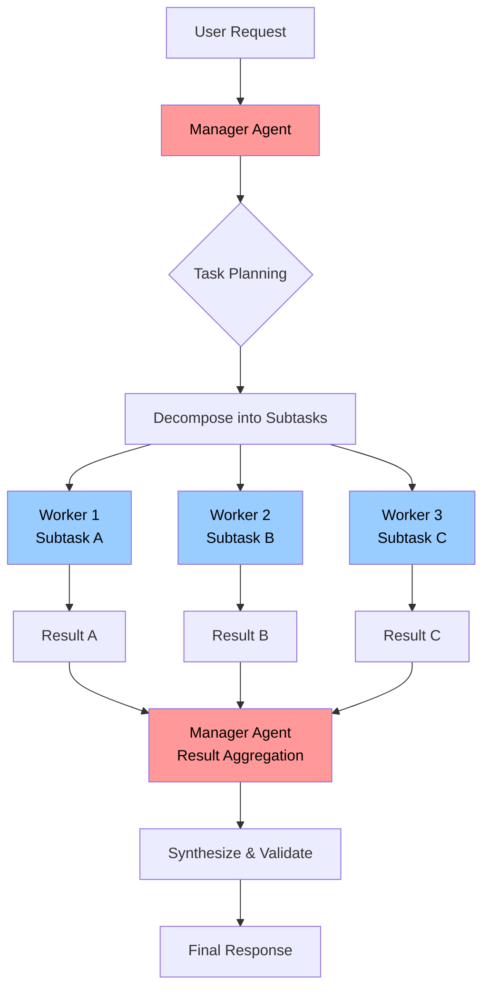

# Multi-agent systems

## The case for multi-agent systems
As your LLM workflows grow more sophisticated, you'll eventually hit a wall with single-agent architectures. An agent that starts by handling customer support tickets might gradually take on order processing, then inventory checks, then fraud detection. Before long, you're dealing with an agent that has access to 30+ tools, a bloated system prompt trying to juggle multiple responsibilities, and increasingly unreliable outputs.

Like when you hire a new employee and give them too many responsibilities, this can confuse an agent and cause the output quality to degrade - sometimes significantly. This can be a major failure mode in production: often, you may be making use of lots of different tools from MCP servers as well as internal tools, plus RAG context and memories - all of which can bloat your context window. This can cause your agent to do things such as attempt to call tools incorrectly or hallucinate.

The solution to this is to create multiple agents that specialise in one subject each, then either use a "manager" agent that manages their execution or have them co-ordinate between each other. A customer support agent might know how to talk to customers but needs help from a fraud detection agent. A research co-ordinator might delegate specific enquiries to domain experts.

## Do I need multi-agent systems?
If your workflow operates in one domain with a focused set of tools (under 10-15), better prompting and context engineering will almost always beat the complexity of needing to manage multiple agents.

Try these first:
- Structured outputs for reducing ambiguity
- Better retrieval (improved chunking, more relevant/complete datasets)
- Tighter constraints, clearer role definitions

The following requirements benefit the most from multi-agent systems:
- Agents that need 20+ tools and start calling wrong/irrelevant tools
- Tasks that require cross-domain co-ordination (eg, documentation writing + product building)
- Context window exhaustion - you've optimised retrieval but still can't fit in all the necessary context
- Clear role delegation boundaries

Without clear boundaries/requirements however, it's better to use one agent with improved context engineering. If you can't clearly articulate why you need a multi-agent system, it is often better to keep it simple.

If you need to measure the metrics for your system to help improve it, you may want to look at [the observability section of this playbook.](./observability.html)

##  Manager-worker pattern
Rig supports manager-worker patterns for multi-agent systems out of the box by allowing agents to be added to other agents as tools, making it easy to form a manager-worker architecture pattern. Below is a diagram that illustrates this concept:



In Rig, we can easily illustrate this with writing two agents called Alice and Bob. Alice is a manager at FooBar Inc., a fictitious company made up for the purposes of this example. Bob is employed by Alice to do some work. We can see how this hierarchy is pretty simple:

```rust
use rig::{
    client::{CompletionClient, ProviderClient},
    completion::Prompt,
};

let prompt = "Ask Bob to write an email for you and let me know what he has written.";
let bob = openai_client.agent("gpt-5")
    .name("Bob")
    .description("An employee who works in admin at FooBar Inc.")
    .preamble("You are Bob, an employee working in admin at FooBar Inc. Alice, your manager, may ask you to do things. You need to do them.")
    .build();

let alice = openai_client.agent("gpt-5")
    .name("Alice")
    .description("A manager at FooBar Inc.")
    .preamble("You are a manager in the admin department at FooBar Inc. You manage Bob.")
    .tool(bob)
    .build();

let res = alice.prompt("Ask Bob to write an email for you and let me know what he has written.").await?;

println!("{res:?}");
```
Under the hood, OpenAI will initially return a tool call to prompt Bob (with a prompt provided by the LLM). Rig executes this by prompting Bob with the given prompt. Bob will then return a response back to Alice, then Alice will return the response back to us using the information provided by Bob.

If you do it this way, make sure you give your agents a name and description as both of these are used in the tool implementation. This can be done by using `AgentBuilder::name()` and `AgentBuilder::description()` respectively in the agent builder.

## Distributed agent architecture (swarm behaviour)
Although swarm-style agent architecture is not supported out of the box with Rig, we can easily re-create it by using the actor pattern.

Generally there are a lot of ways you can do this, but typically a participant (ie an agent) in any given swarm may have the following:
- Some kind of external trigger
- A way to process messages from other swarm participants

Let's get into some code snippets for creating agents that use an actor pattern to be able to simulate swarm behaviour. First, let's define some types for possible message and the agent itself, plus some methods for talking to other connected peers:

```rust
use rig::providers::openai;
use rig::completion::Prompt;
use tokio::sync::mpsc;
use std::sync::Arc;
use tokio::sync::RwLock;

/// Message types for inter-agent communication
#[derive(Debug, Clone)]
enum AgentMessage {
    Task(String),
    Response(String, String), // (from_agent_id, content)
    Trigger(String),
    Shutdown,
}

/// Agent state
struct AgentState {
    id: String,
    task_queue: Vec<String>,
    conversation_history: Vec<String>,
}

/// Actor-based autonomous agent
struct AutonomousAgent {
    id: String,
    client: openai::Client,
    state: Arc<RwLock<AgentState>>,
    inbox: mpsc::Receiver<AgentMessage>,
    outbox: mpsc::Sender<AgentMessage>,
    peer_channels: Arc<RwLock<Vec<mpsc::Sender<AgentMessage>>>>,
}

impl AutonomousAgent {
    fn new(
        id: String,
        api_key: String,
        inbox: mpsc::Receiver<AgentMessage>,
        outbox: mpsc::Sender<AgentMessage>,
    ) -> Self {
        let client = openai::Client::new(&api_key);
        let state = Arc::new(RwLock::new(AgentState {
            id: id.clone(),
            task_queue: Vec::new(),
            conversation_history: Vec::new(),
        }));

        Self {
            id,
            client,
            state,
            inbox,
            outbox,
            peer_channels: Arc::new(RwLock::new(Vec::new())),
        }
    }

    /// Register peer agents for communication
    async fn register_peer(&self, peer_channel: mpsc::Sender<AgentMessage>) {
        let mut peers = self.peer_channels.write().await;
        peers.push(peer_channel);
    }

    /// Send message to all peer agents
    async fn broadcast_to_peers(&self, message: AgentMessage) {
        let peers = self.peer_channels.read().await;
        for peer in peers.iter() {
            let _ = peer.send(message.clone()).await;
        }
    }

    /// Process autonomous task using LLM
    /// This currently shows a simple LLM prompt, but if you wanted you could give your agent some tools!
    async fn process_autonomous_task(&self, task: &str) -> Result<String, rig::completion::PromptError> {
        let agent = self.client
            .agent("gpt-5")
            .preamble(&format!(
                "Your name is {}. Process tasks autonomously and coordinate with other agents.",
                self.id
            ))
            .build();

        let response = agent.prompt(task).await?;
        Ok(response)
    }
}
```

Next is the final piece we need to make our agent work: handling messages and the actual run loop. 

Since we want to be able to *both* run tasks from both an autonomous trigger as well as received messages, we use the `tokio::select!` macro. This macro basically works by executing the first future that finishes. In this case, we'll use a `tokio::interval` timer to essentially create a control flow that can either be executed from the timer successfully ticking, or the agent receiving a message (whichever one comes first!).

```rust
use tokio::time::{interval, Duration};

impl AutonomousAgent {
    async fn handle_message(&self, task: AgentMessage) {
o       match task {
            AgentMessage::Task(task) => {
                println!("[{}] Received task: {}", self.id, task);
                
                match self.process_autonomous_task(&task).await {
                    Ok(result) => {
                        println!("[{}] Completed task: {}", self.id, result);
                        
                        // Store in history
                        let mut state = self.state.write().await;
                        state.conversation_history.push(format!("Task: {} | Result: {}", task, result));
                        
                        // Broadcast result to peers
                        self.broadcast_to_peers(
                            AgentMessage::Response(self.id.clone(), result)
                        ).await;
                    }
                    Err(e) => eprintln!("[{}] Error processing task: {}", self.id, e),
                }
            }
            AgentMessage::Response(from_id, content) => {
                println!("[{}] Received response from {}: {}", self.id, from_id, content);
                let mut state = self.state.write().await;
                state.conversation_history.push(format!("From {}: {}", from_id, content));
            }
            AgentMessage::Trigger(trigger_msg) => {
                println!("[{}] External trigger: {}", self.id, trigger_msg);
                // Process trigger autonomously
                let _ = self.process_autonomous_task(&trigger_msg).await;
            }
            message => {
                println!("Unsupported message variant received: {message:?}");
                // this could theoretically return an error or panic
                // this should never return the shutdown enum variant because enums are eagerly evaluated
            }
        }
    }
    
    // Main actor loop
    async fn run(mut self) {
        println!("Agent '{}' started and running autonomously", self.id);
        
        // External trigger: periodic self-check (runs every 10 seconds)
        let mut tick_interval = interval(Duration::from_secs(10));
        
        loop {
            tokio::select! {
                // Handle incoming messages from other agents
                Some(msg) = self.inbox.recv() => {
                    match msg {
                        AgentMessage::Shutdown => {
                            println!("Shutting down...");
                            break
                        }
                        _ => {
                            self.handle_message(msg).await;
                        }
                    }
                }
                // Autonomous periodic task (external trigger)
                _ = tick_interval.tick() => {
                    println!("[{}] Autonomous tick - checking for self-initiated tasks", self.id);
                    
                    // Check if agent should create its own task
                    // Use scoped brackets here to avoid needing to manually drop lock
                    let needs_to_create_own_task =  {
                        let state_rlock = self.state.read().await;
                        state_rlock.task_queue.is_empty() && !state_rlock.conversation_history.is_empty()
                    };
                    
                    if needs_to_create_own_task  {
                        let summary_task = "Summarize what you've accomplished so far in one sentence.";
                        match self.process_autonomous_task(summary_task).await {
                            Ok(summary) => {
                                println!("[{}] Self-initiated summary: {}", self.id, summary);
                            }
                            Err(e) => eprintln!("[{}] Error in autonomous task: {}", self.id, e),
                        }
                    }
                }
            }
        }
    }
}
```

Below is a code snippet to showcase this:

```rust
#[tokio::main]
async fn main() -> Result<(), Box<dyn std::error::Error>> {
    let api_key = std::env::var("OPENAI_API_KEY")
        .expect("OPENAI_API_KEY must be set");

    // Create channels for agent communication
    let (tx1, rx1) = mpsc::channel(100);
    let (tx2, rx2) = mpsc::channel(100);
    let (tx3, rx3) = mpsc::channel(100);

    // Create agents
    let agent1 = AutonomousAgent::new("Tom".to_string(), api_key.clone(), rx1, tx1.clone());
    let agent2 = AutonomousAgent::new("Richard".to_string(), api_key.clone(), rx2, tx2.clone());
    let agent3 = AutonomousAgent::new("Harry".to_string(), api_key, rx3, tx3.clone());

    // Register peers (each agent knows about the others)
    agent1.register_peer(tx2.clone()).await;
    agent1.register_peer(tx3.clone()).await;
    agent2.register_peer(tx1.clone()).await;
    agent2.register_peer(tx3.clone()).await;
    agent3.register_peer(tx1.clone()).await;
    agent3.register_peer(tx2.clone()).await;

    // Spawn agent actors
    let handle1 = tokio::spawn(agent1.run());
    let handle2 = tokio::spawn(agent2.run());
    let handle3 = tokio::spawn(agent3.run());

    // Send initial task to Agent-Alpha
    tx1.send(AgentMessage::Task("Analyze the benefits of autonomous agent systems".to_string())).await?;

    // External trigger example
    tokio::time::sleep(Duration::from_secs(5)).await;
    tx2.send(AgentMessage::Trigger("Check system status and report findings".to_string())).await?;

    // Let agents run for demonstration
    tokio::time::sleep(Duration::from_secs(30)).await;

    // Shutdown
    tx1.send(AgentMessage::Shutdown).await?;
    tx2.send(AgentMessage::Shutdown).await?;
    tx3.send(AgentMessage::Shutdown).await?;

    handle1.await?;
    handle2.await?;
    handle3.await?;

    Ok(())
}
```

If you are interested in taking AI agent swarms to production using actor patterns, you may want to look into `ractor`. Ractor is currently the most popular Rust actor framework, is being used actively at companies like Kraken (the crypto exchange) and Whatsapp and additionally has cluster support.
