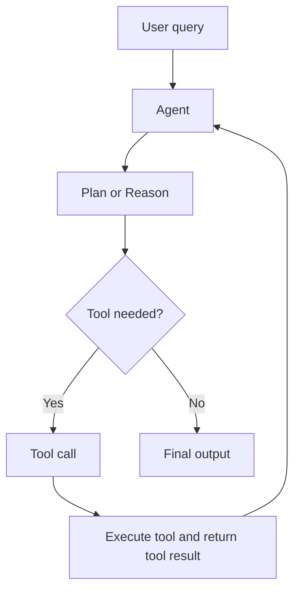

# Calling Model Providers with Rig

The full example for this section can be found [on the GitHub repo.](https://github.com/0xPlaygrounds/rig-book/blob/main/snippets/rig-api-call/src/main.rs)

Let's get started by writing your first API call to a model provider. While Rig does have support for local models (through ollama, LM Studio through OpenAI Chat Completions, as well as other local providers), the majority of practical applications are through third party providers. 

To get started, create a new project:

```bash
cargo init my-first-project
cd my-first-project
```

Next, we'll add some required dependencies:
```bash
cargo add rig-core@0.25.0 tokio -F tokio/macros,rt-multi-thread
```

Now we're ready to write some code!

## Provider clients
You can create a provider client in one of two ways:
- `Client::new()` takes the API key directly
- `Client::from_env()` - attempts to use environment variables for API keys and will panic on none being provided

An example can be found below:

```rust
use rig::providers::openai::Client;
#[tokio::main]
async fn main() {
    /// uses `OPENAI_API_KEY` environment variable
    let openai_client = Client::from_env();
}
```

## Agents
To create an agent, you'll need to create it using the client we just made. For now we'll call our agent Bob.

```rust
use rig::client::{CompletionClient, ProviderClient};
use rig::completion::Prompt;
use rig::providers::openai::Client;

#[tokio::main]
async fn main() -> Result<(), Box<dyn std::error::Error>> {
    let openai_client = Client::from_env(); // method provided by the ProviderClient trait

    let agent = openai_client
        .agent("gpt-5") // method provided by CompletionClient trait
        .preamble("You are a helpful assistant.")
        .name("Bob") // used in logging
        .build();

    let prompt = "What is the Rust programming language?";
    println!("{prompt}");

    let response_text = agent.prompt(prompt).await?; // prompt method provided by Prompt trait

    println!("Response: {response_text}");

    Ok(())
}
```
Running this snippet should return logs that look something like this:

```bash
What is the Rust programming language?
Response: Rust is a modern, statically typed systems programming language focused on safety, speed, and concurrency without a garbage collector. It was started at Mozilla and is now stewarded by the Rust Foundation; Rust 1.0 shipped in 2015.

Key ideas and features:
- Memory safety by design: ownership, borrowing, and lifetimes checked at compile time prevent use-after-free, null/dangling pointers, and data races in “safe Rust.”
- Zero-cost abstractions: high-level features (traits, enums/ADTs, pattern matching, iterators) compile down to code as efficient as hand-written C/C++ in most cases.
- No GC, RAII-based resource management; “unsafe” escape hatch for low-level control when needed.
- Strong tooling: cargo (build/test/deps), crates.io (packages), rustup (toolchains), rustfmt, clippy, built-in docs and testing.
- Concurrency: fearless concurrency with Send/Sync types; async/await available via libraries (e.g., Tokio).
- Cross-platform and interoperable: great C FFI, targets from embedded to WebAssembly.

Common uses:
- Systems software (OS components, drivers), networking services, CLI tools, embedded/IoT, game and graphics engines, crypto, and WebAssembly apps.

Trade-offs:
- Steeper learning curve (ownership/borrow checker) and longer compile times compared to some languages, though both improve with experience and tooling.
```

Like all other agentic frameworks, agents in Rig at their core are simply LLM calls that can handle tool calling for you (and the tools can make use of environment variables, database connection pools, etc...). This eliminates a lot of the boilerplate for needing to write your own agentic loops as they are considered a staple of building AI systems.



### Streaming
Streaming responses with agents is quite simple! To do so, instead of using `prompt()`, you use `stream_prompt()` instead:

```rust
use futures::Stream;

let mut stream = agent.stream_prompt(prompt).await;

while let Some(item) = stream.next().await {
    // .. do some work here
}
```

## Calling completion models directly
Calling completion models is also relatively simple.

To do so, you'll need to import the `CompletionsClient` trait (from the `client` module) and use the method.

```rust
/// the completion model trait is provided through the CompletionsClient trait!
use rig::client::CompletionsClient;

let openai_client = Client::from_env();

let openai_completions_model = openai_client.completion_model("gpt-5");
```

Next, there's two ways you can call a completion request through the `CompletionModel` trait.

The first one is creating a `CompletionRequest` and calling `CompletionModel::completion()`. You can see the code below:

```rust
//NOTE: OneOrMany is an abstraction that ensures there's always at least one element
let message = Message::User {
    content: OneOrMany::one(UserContent::text("What is the Rust programming language?"))
};

let req = CompletionRequest {
    messages: OneOrMany::one(message),
    premamble: Some("You are a helpful assistant.".to_string()),
    ..Default::default()
};

let response = openai_completions_model.completion(req).await?;
```

You can also `CompletionModel::completion_request` with the prompt text we want to use, then using the builder methods:

```rust
let response = openai_completions_model
    .completion_request("What is the Rust programming language?")
    .preamble("You are a helpful assistant")
    .send()
    .await?;
```

## Should I use agents or direct completion models?
If you just want a way to prompt a model and don't care about the specifics of the contents of the completion model itself, use `rig::agent::Agent`. Agents will also automatically handle tool calling for you, meaning that you can avoid writing all the boilerplate that this would typically require.

If you need more low level control over the agentic loop than what Rig requires, using the completion model manually is often more effective. One use case for this is that you may want to decide whether or not to simply return a tool result or use the result in the next prompt based on a given tool result.
